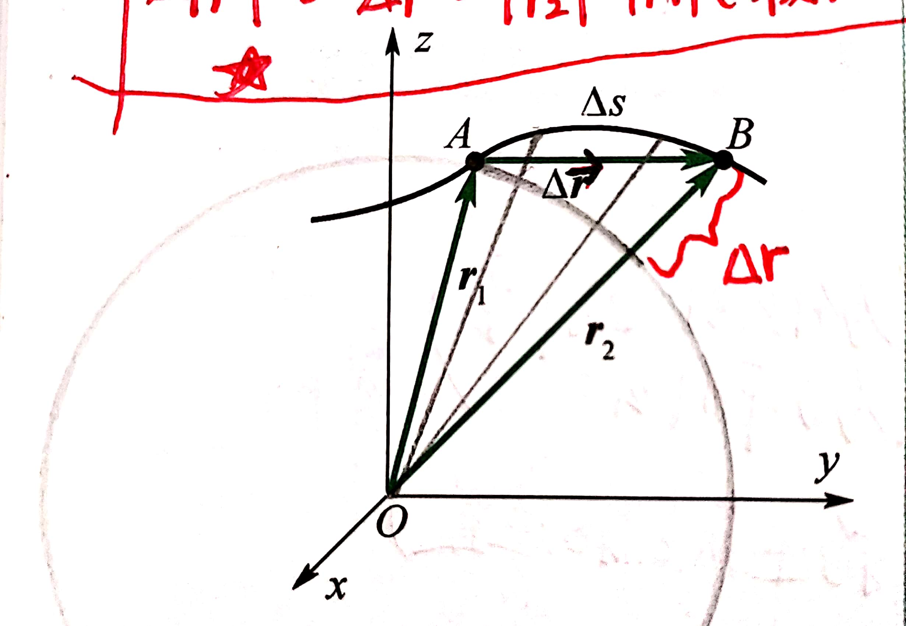
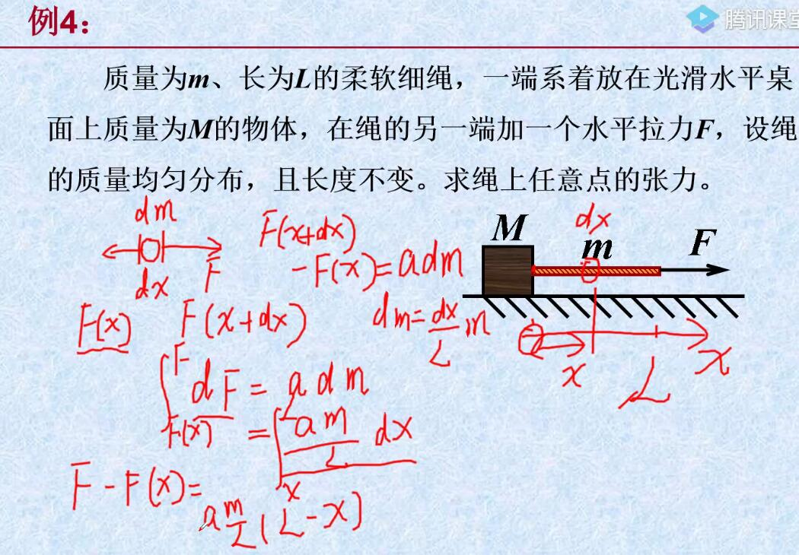
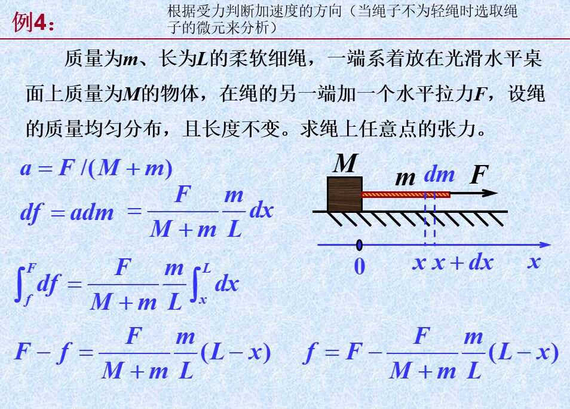
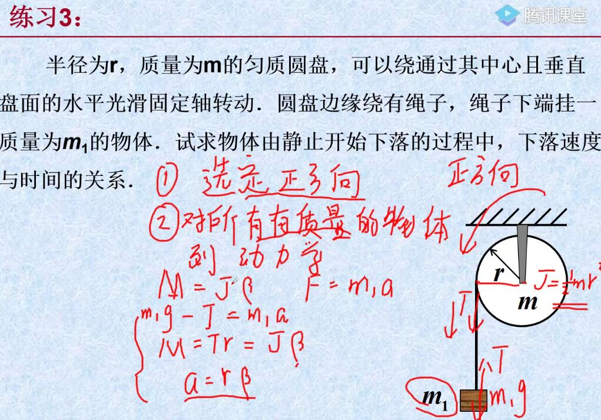
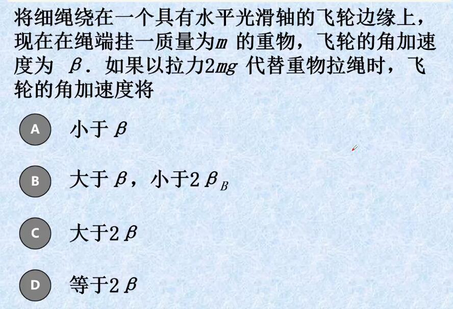
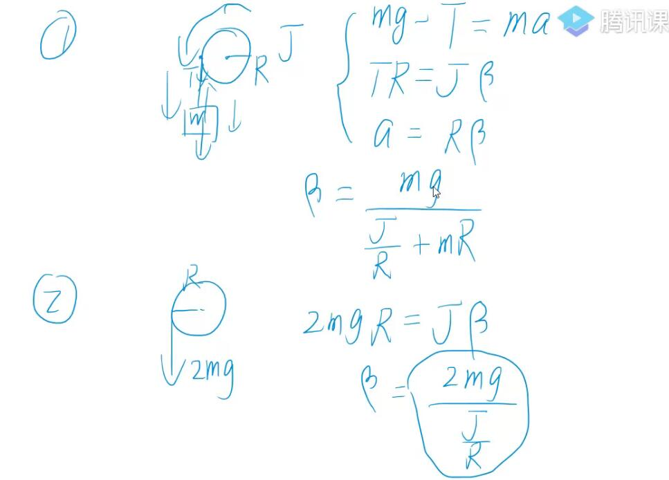

# 大物笔记

物理学习方法：
理解清楚每一个概念，每一个物理量的意义，单位

[TOC]

# 第一章 质点运动学

## 1.1 参考系 坐标系 物理模型

## 1.2 位矢 位移 速度 加速度

### 1.2.1 位移:

 **注**:
$d表示微分且仅表示非常短的一段变化,说明此时$
$$\Delta t \rightarrow 0.$$

$\Delta 表示一段时间变化,可以指很长一段变化,也可以指很短一段变化,此时$
$$\Delta t=t_2-t_1$$

$$
\begin{cases}
    \Delta\vec{r}=\vec{r_2}-\vec{r_1} & 表示位移增量\\
    \Delta|\vec{r}|=\Delta r=|\vec{r_2}|-|\vec{r_1}| & 表示初末位移模的增量 \\
    |\Delta\vec{r}|=|\vec{r_2}-\vec{r_1}| & 表示位移增量的模 \\
\end{cases}
$$

当在$\Delta t$时间段内:
$$
\begin{cases}
|\Delta\vec{r}|\not ={\Delta s} \\
|\Delta\vec{r}|\not ={\Delta r} \\
\Delta\vec{r}\not ={\Delta r} \\
\Delta s\not ={\Delta r} \\
\end{cases}
$$

当$\Delta t \rightarrow 0$时有:

$$
\begin{cases}
|d\vec{r}|=ds \\
|d\vec{r}|\not ={dr}=d|\vec{r}| \\
|d\vec{r}|\not ={d|\vec{r}|} \\
d\vec{r}\not ={dr}
\end{cases}
$$
### 1.2.2 速度
平均速度:$$\overline{\vec{v}}=\frac{\Delta\vec{r}}{\Delta t}$$
平均速率: $$\overline{v}=\frac{\Delta s}{\Delta t}$$

瞬时速度:
$$

瞬时速率:
$$v=|\vec{v}|=\lim_{\Delta t\rightarrow 0}\frac{\Delta s}{\Delta t}=\frac{ds}{dt}=\frac{|d\vec{r}|}{dt}\not ={\frac{dr}{dt}}$$
$v=|\vec{v}|$(瞬时速度的模=瞬时速率)
径向速度(法向速度):
$$v_r=\frac{\Delta r}{\Delta t}$$
切向速度
$$v_t$$
真·速度
$$\vec{v}=\vec{v_t}+\vec{v_r}=v_t\vec{e_t}+v_r\vec{e_r}$$

### 1.2.3 加速度

速度的二阶导数

## 1.3 曲线运动的描述

水平方向匀速直线运动
竖直方向匀加速直线运动
（直线运动可不加箭头）
积分根据定义写出式子，分离变量，根据初始条件两边积分
积分注意积分变量上下限要对应积分变量
注意写单位$(SI)或准确的单位$

求曲率半径：先求总的加速度，再根据加速度求曲率半径（P11（1-23））

注意区分角量和线量
$K=\frac{|y'|}{(1+y'')^\frac{3}{2}}$

求积分时如果有哪些量需要消掉可以用凑恒等变换的方法 乘一个除一个
e.g
$a=-ky$求$v$与$y$的关系
$a=\frac{dv}{dt}=-ky$
$\frac{dv}{dy}*\frac{dy}{dt}=-ky$
$\frac{dv}{dy}v=-ky$
然后分离变量即可

## 1.4 运动学中的两类问题

## 1.5 相对运动

# 第二章 质点动力学

## 2.1

求解微分方程时多利用恒等变换和物理量定义消去时间$t$

有时候虽然题目给的量符合动量定理，但也有可能是用动能定理，可以约去时间

**非轻绳问题分析：**

这类问题一般要先把绳子分成很小一段的**微元**，长度为$dx$，质量为$dm$，则$dm$与$dx$的关系就是$dm=\frac{dx}{L}m$(可以理解为$\frac{dm}{dx}=\frac{m}{L}$)。然后对其进行研究、分析(一般可以应用牛二律分析)研究绳子的范围是从$x$到$L$(即绳子受力端)，当分析$x$处的力时把绳上各点所受的力记为函数$F(x),x$为绳上各点的坐标，确定好积分上下限进行**积分**

# 第三章 刚体力学基础

用拉力代替重物的时候相当于只有一个有质量的物体，拉力拉一个有质量的物体，挂重物的时候要考虑重物的质量
# 第四章 机械振动 机械波

# 第五章 气体动理论

## 5.1

## 5.2

## 5.3

## \*5.4

## \*5.5

# 第六章 热力学基础

## 6.1

## 6.2

## 6.3

## 6.4

## 6.5

## \*6.6

# 第七章 静电场

## 7.1

## 7.2

## 7.3

## 7.4

## 7.5

## 7.6

# 第八章 稳恒磁场

## 8.1

## 8.2

## 8.3

## 8.4

## 8.5

## 8.6

# 第九章 变化的电磁场

## 9.1

## 9.2

## 9.3

## 9.4

## 9.5

# 第十章 波动光学

## 10.1

## 10.2

## 10.3

## 10.4

## 10.5

# 第十一章 狭义相对论

## 11.1

## 11.2

## 11.3

## 11.4

# 第十二章 量子物理基础

## 12.1

## 12.2

## 12.3

## 12.4

## 12.5

## 12.6

## 12.7
