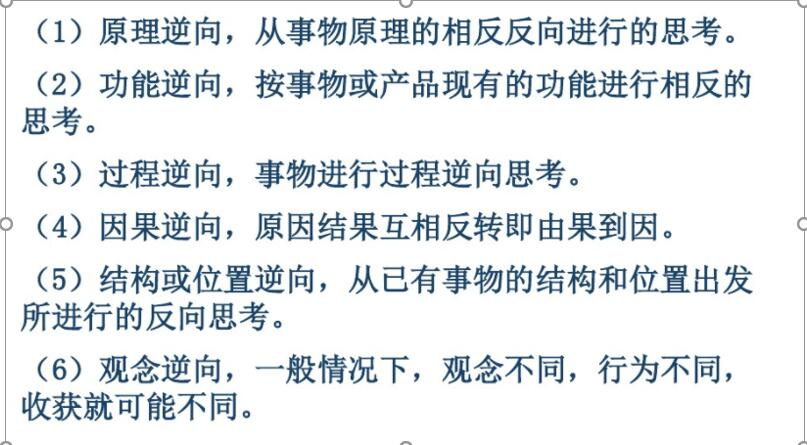

# 工程概论

大创：
网上调查、咨询会议（问商家）、手工设计、现场征求意见、市场调研、生产方式
“互联网+”申报书
**写清技术路线**

## 目标

1. 培养工程意识

2. 解决工程问题一般流程

3. 工程问题非技术性社会因素

4. 工程师的职业操守  

## 第一章

### 1.1 工程

工程的历史是我们人类适应自然、改造自然的历史

硬工程：硬件
软工程：软件

### 1.2 复杂工程问题

“复杂工程问题”，Complex Engineering Problems，指的是复杂的工程问题，而不是复杂工程的问题。“复杂工程问题”必须具备下述特征（1），同时具备下述特征（2）—（7）的部分或全部：

- （1）必须运用深入的工程原理，经过分析才可能得到解决；
- （2）涉及多方面技术、工程和其它因素，并可能相互有一定冲突；
- （3）需要通过建立合适的抽象模型才能解决，在建模过程中需要体现出创造性；
- （4）不是仅靠常用方法就可以完全解决的；
- （5）问题中涉及的因素可能没有完全包含在专业工程实践的标准和规范中；
- （6）问题相关各方的利益不完全一致；
- （7）具有较高的综合性，包含多个相互关联的子问题。

通过一步一步不断分析，思考出错的地方，逐个排除，运用知识解决
要考虑方方面面，考虑多种可能。包括多个学科的知识

### 结论:工程技术是我国生产力，使用工程技术要考虑环境等方面

## 第二章 工程与科学

### 2.1 定义

#### 2.1.1

- 什么是科学

 科学不仅仅是关于自然的事实、概念及有用思想的集合，而且是对自然的系统探索和研究。
    科学是探索、了解自然并揭示可靠自然知识的方法。
    科学具有挖掘和发现可靠知识的属性。

- 什么是工程

大英百科全书将工程定义为“应用科学原理将自然资源，以优化的方式转换成结构、机器、产品、系统及工艺，以造福人类的方法”。
    工程是应用于实际的、科学的、符合数学法则、重视经验、需要判断力和常识的艺术。
    工程是创造造福人类产品的手段。
    工程师不仅在把产品推向市场的过程中起着关键的作用，工程师还是一些非常具有挑战性的人类探索活动的核心参与者。

#### 2.1.2 工程学

对工程的研究

### 2.2 工程与科学的关系

科学工作者（家）研究**现有的世界**。工程师则创造**从未有过的世界**。”
        --------西奥多·冯·卡门  

简言之，科学是**分析、发现**，工程是**综合、创造**。

### 2.3

本科生：学会研究，学会解决问题，学算法，学会项目写作

**科学思维**：
    就是从以往的经历中获取经验，科学地解决问题

**辩证思维**：
    辩证性思维是一个人通过科学的思维获得问题的答案或解决问题的方法的思维方式。

### 2.4\star思维方式

横向思维：当前与周围的对比
工程思维：思考工程问题

#### 2.4.1科学思维、辩证思维

科学思维：任何人，即使并不研究和探索自然，只要学习科学方法或应用科学知识都可以认为在进行科学思维。（应用到所有学科）

$\star$辩证思维：辩证性思维是一个人通过科学的思维获得问题的答案或解决问题的方法的思维方式。（从正反两方面看,知晓正确的思维方式并获得可靠地结论
）

#### 2.4.1.1 科学思维

- 基于或采用实验的证据（实验主义：永远基于实验证据）
    实验证据:
善感的:可以看见、听见、摸到、尝到或闻到的证据，是人们可以通过感官感觉到得的证据;
可重复的:其他人也能感受到的证据
权威证据
机构（如政府、书籍、数据排行榜、电视广告等）发布的。
必须依靠我们自己的辩证思维，去判断证据的真伪。

- 进行逻辑推理（逻辑推理）
    科学家及辩证思维者总是采用逻辑推理
通常采用逻辑推理需要与个人愿望作斗争
学习逻辑思维最有效的方法是在哲学课程、数学课程及科学课程学习中，强迫自己采用逻辑思维、阅读伟大的经典文学作品、学习历史并且经常练习写作。
（要自学财务）
- 对现有知识的质疑态度（包括自我质疑、避免过早结论、不固执己见）（质疑主义：永远采取质疑的态度）
    科学与辩证思维最后一个关键思想是质疑主义，即永远质疑自己的观点和结论。
真正的科学家和辩证思维者总是不断检查其观点的证据、命题和原因。
检验信息正确性的一种方法是通过预测你所持观点的结果或逻辑输出以及根据你的观点所采取的行动来将你的观点与客观现实做比对。
科学对新的思想同样采取质疑态度：完美的观点需要完美的证据。

#### 2.4.1.2 解决问题的实用科学方法

- 基于科学思维与辩证思维的常用科学方法，可按如下步骤进行：
    确定研究课题：找课题 从**软件杯、互联网+、热门研究话题**找课题
    调研：**社会痛点**（哪些人群的）
    提出解决方案
    验证：检验结果
    判断：
    作出结论：总结问题

#### 2.4.1.3横向思维

横向思维

- 横向思维解决问题
    以非直接的形式绕过问题
    与传统逐步逻辑方式不同(跳出传统思维)
    A思想+B产品成果=C新产品（从生产实践中发现的问题，横向思维解决）
- 表现形式
    侧视其他方向，将注意力从所从事或关注的领域，引向其它更广阔的领域；
将其他领域已成熟的、较好的技术方法、原理等直接移植到所从事或关注的领域或问题的解决方案加以利用；
从其他领域事物的特征、属性、机理中得到启发，改变对原来思考问题的思维模式，并获得新颖想法。

e.g
    A别人的算法+B别人的算法=C自己的算法
    根据别人算法的缺点 用B算法解决这个缺点就是自己的
    玩**我的世界**锻炼创新思维

思维要有条理，发散思维——创造思维（由一样事物联想各种事物）

#### 2.4.1.4$\star$求解问题的思维方式

假设猜测->调用知识->是否有解->定量分析

所有工程问题都可以被分成两类：

1. 简单问题
    a.对于简单问题，评价准则和约束性质上都是相似的。
    b.解决简单问题的思路是基于知识的推理。
2. 复合问题
    a.复合问题的评价指标具有不相似的性质，因此不能同时对它们进行优化。
    b.工程工作需要对功能、可靠性、成本、安全性、使用寿命及外观等进行综合考虑。
    c.大部分系统工程师的工作都具有很强的综合性。
    d.只要材料、子系统及方法的选择因为某种性能的原因相互约束，这个问题就是复合问题。
    e.复合问题分解成简单问题

思考方式:

1. 需求分析
2. 文案写作
3. 编程实现分析

复合问题解决策略:

- 策略一：舍弃不能测量的准则或标准（criteria）
    例如，我们无法对产品的美学进行度量。
    然而，如果美学准则被舍弃了，有必要建立明确的“丑陋”限度。
- 策略二：基于现实情况，表述准则或标准的相对值，然后尝试将复合问题转换成简单问题
    a.基于现实情况，表述准则或标准的相对值，然后尝试将复合问题转换成简单问题
成本效益分析一般采用流通货币作为约束及准则。
b.当工程师进行这项工作时，对于某一特征值，他们需要像经济学家一样回答相同的经济（及哲学的）问题。
c.工程师需要面对各种性质不同的约束及其它们之间的联系。通常需要在速度与精度、速度与尺寸之间进行取舍以寻求平衡与优化。
d.当工程师决定一项取舍时，需要对某一相对值进行判断并作出相应的解释
(互联网+注重技术创新,不限人数,可以与外校联合，突出壮乡风情)
- 策略三：将问题分解为可以单独解决的简单问题
    a.几乎所有的工程实际问题都会被分解为子问题，这些子问题几乎完全可以逐个、单独地得到解决。
b.关键是工程师如何选择分解的途径或方法
c.如何确定各子问题优化的积累，可以获得全局优化，或至少接近全局优化。
d.项目的总体目标，比如，采用现有零件、新设计的可重复使用性、将性能和特征模块化等，将直接影响复杂问题的分解方案。项目目标实际上是一个评价准则。

#### 2.4.1.5工程师如何思考

- 复合问题包含简单问题，而简单问题的解决方案部分可以通过推理获得。
- 执业工程师也许和执业律师一样采用类比的方法。

    a.通过参考以前的工作，发现相似性和不同点，并与当前问题进行关联是工程师常规的工作习惯。
    b.相似性作出判断的能力，特别是在对不同准则的参数值进行平衡时，是工程判断能力的核心。
    c.解释这些类似性，并对该类似性进行论证的能力，就是工程语言能力（engineering rhetoric）。

## 第三章 工程师、工程、技术

工程师就是创造和设计一些东西来解决问题
什么问题要被解决、谁的问题需要解决、为什么这些解决这些问题很重要

### 3.1工程与技术

#### 3.1.1工程与技术的关系

技术是工程的实现手段；
技术是沟通工程与科学的桥梁；
两者所需科学基础知识和技能非常相似。

#### 3.1.2工程师解决问题的方法

工程师是解决问题的人：
类比推理；
工程思维；
对给定问题，探索发现并验证获得的解决方案为最佳，并能对之进行解释。

#### 3.1.3工程师要有的能力

技术能力
职业能力
交流能力
表述能力
社交能力
工作态度
终生学习能力

#### 3.1.4总结

工程师是需要**创造力**的艺术家
工程师的工作要点就是依赖**科学**、**数学**及**方法学**，**解决实际工程问题**，并采用**技术交流语言**，诠释、展示解决方案或模型；
工程师是解决问题的人，不仅要掌握简单问题的**推理**解决方法，还要掌握解决**复合问题**的思维方法；
成为工程师不仅要具备优秀的**技术技能**，更需要具备良好的职业素养。

## 第四章 创造力

创造力体现为一类特定的实践活动

- 个体运用他所掌握的知识**发现新问题**(社会痛点)，对问题寻求答案，以及在某种特殊情况下，用特殊的体系来改革与创新的一种有选择的自我调配加工的活动
- 发现和解决新问题，提出新设想，创造新事物
- 强调创造力的发挥过程，强调创造力的实践性，这也是一种发现问题到解决问题的过程
- 要有**好奇心**，要**仔细观察生活**的一切，一切都从**生活**而来，保持**好奇心**

### 4.1创造力

#### 4.1.2创造力来源于想象力

1. **敢想** 嫦娥奔月——上月球
2. **联想** 正确的握笔姿势——握笔器
3. **多想** （想的全面周到，考虑都方方面面）牛顿万有引力定律

### 4.2创造来自需求

一切的创造都是为了满足需求，正是因为有了需求才能有创新
为了解决问题而创新

### 4.3 创造的方法

提出想法后到中国专利局查这个想法有没有人提出来，如果有提出来就在这个基础上进行改良。（互联网+要有自己的东西，所以要查这个思想是不是有人申请了）

1. 坚持不懈
2. 多问为什么（发现问题，咋找到问题，保持好奇心）
3. 永不满足（让一个产品更好）
从失败或事故中学习经验（把坏的东西变成好的）
4. 善于类比（关联各种知识，找到解决办法）
5. 及时归纳总结（总结经验，提供借鉴）
6. 培养定性和定量分析能力（）
7. 良好的形象思维能力（空间思维能力）
8. 良好的绘图能力（将思想用图的方式表达，思想可视化）
9. 发散思维能力
10. 广泛的兴趣（参考毕导）
11. 挖掘隐藏的信息
12. 遵循自然法则（符合客观事实）

## 创造的一般方法

### 方法

- 三阶段模式:
  发现**问题**——提出**假说**——**解决问题**
- 四阶段模式:
  准备——酝酿——明朗——验证
- 五阶段模式:(目前**现在**的思考方法)
  初识一一准备——孕育一一启发一验证

- 五阶段模式：
  ——感到某种**困难**的存在；
  ——认清什么是**问题**；
  ——搜集资料、进行分类，并**提出假说**
  ——接受或抛弃试验性的**假说**，
  ——得出结论并加以评说。

要绘制系统功能图

### 创新的方法

1. 组合创新法
2. 类比创新法
3. 转换创新法

善于观察才能发现问题

### 创造产品的一般流程

第一步：确定需求并定义问题

- 了解真实需求是产品开发成功与否极为重要的第一步。(发现痛点)

- 撰写产品设计任务书
顾客需求和分析市场、需求列表、分析其他有竞争力的产品

第二步：组织设计团队

- 设计和开发工作无法依赖某个天才独立完成，必需由来自不同领域的工程师及技术专家共同完成。

第三步：确定约束条件和设计要求

- 确定约束条件（预算、时间、人员、法律、产品涉及的技术成熟度及可用性、材料的性能和可用性、竞争对手、工艺性）
**技术上不成熟就要找替代方案**

第四步：寻找解决方案（方案设计）

- 方案设计可以看成是两阶段的过程：方案形成和方案论证（评估）
方案形成：避免设计需求和解决方案混淆、经常质疑基本假设、注意获取和积累知识与经验、采用类比方法、空间想象力、确定临界参数、转换功能、改变流程或步骤的顺序、逆向思维、增加同一零件数目或重复同一工艺步骤、将功能分解、将功能集成、运用基本的工程原理

方案论证阶段

第五步：分析每个潜在方案
第六步：选出最佳方案
第七步：书面描述方案
第八步：把方案提交给管理层

## 研究生

探究新技术
探究大数据和计算机图像处理
yolo 自动识别人
应用到各方面

## 职业道德

