# 离散数学

[TOC]

## 集合论基础——集合

### 1.集合定义

- 用带或不带下标的**大写**英文字母表示**集合**:$A,B,C,...,A_1,B_1,C_1,...$
- 用带或不带下标的**小写**英文字母表示**元素**:$a,b,c,...,a_1,b_1,c_1,...$

注：元素所表示的事物可以是具体事物、抽象事物、集合
元素必须是确定的和可区分的

#### 1.1 常用集合

- 自然数$N:0,1,2,3,...$(所有**自然数**组成的集合，包括 0)
- 整数$Z(I):...,-2,-1,0,1,...$(所有**整数**组成的集合)
- 有理数集合$Q:$(所有**有理数**组成的集合)
- 实数集$R:$(所有**实数**组成的集合)

#### 1.2 属于关系（隶属关系）

- 如果 a 是集合 A 中的元素,则:$a\in A$
- 如果 a 不是集合 A 中的元素,则:$a\notin A$
  **(也就是说如果 a 是集合 A 的元素才是隶属关系，否则是包含关系)**
  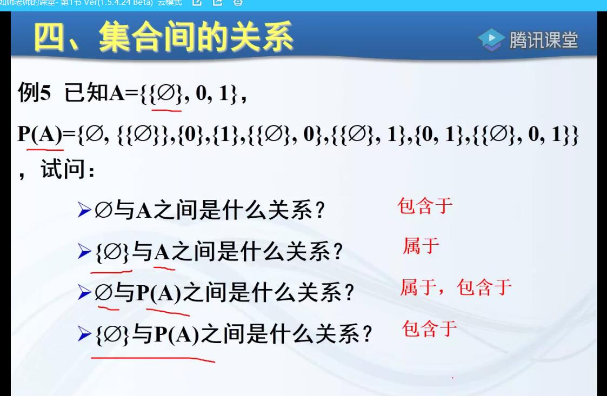

### 2.集合表示

#### 2.1 枚举法

- 列出集合中全部元素或者仅列出一部分元素,其余用省略号($...$)

$A=\lbrace a,b,c,d\rbrace$
$B=\lbrace 2,4,6,8,...\rbrace$

#### 2.2 叙述法(描述法)

- 通过刻画集合中元素所具备的某种性质或特性来表示
  $P=\lbrace x|P(x)\rbrace$
  (定义的变量要有意义，从英语来或者其他。。。。)

$A=\lbrace x|x是英文字母中的元音字母\rbrace$
$B=\lbrace x|x\in Z,x<10\rbrace$

#### 2.3 图形法

文氏图是利用平面上的点做成对集合的图解方法，一般使用平面上的方形或圆形表示集合，小圆点表示元素

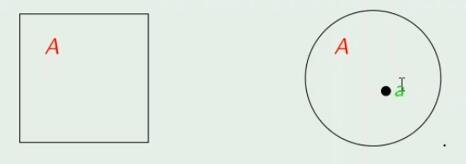

### 3.集合

#### 3.1 基数

- 集合$A$中元素的个数为基数,记为$|A|$
- 集合的基数是有限的,称为**有限集**
- 集合的基数是无限的,称为**无限集**
  $A=\lbrace a,b,c\rbrace,|A|=3$
  $B=\lbrace a,\lbrace b,c\rbrace\rbrace,|B|=2$
  **注**:当集合 B 是集合 A 的元素时，则集合 B 只能看作集合 A 中的**一个元素**(不管集合里面是集合还是其他的东西都只是一个元素)

#### 3.2 空集

- 不含任何元素的集合叫**空集**,记作$\varnothing.$
- 空集也写为$\varnothing=\lbrace x|x\not ={x}\rbrace.$

理解:集合可以看作是一个钱包，钱包里面的钱就是元素，钱包里没钱了，钱包仍然是一个钱包。故集合里面没有任何一个元素时，仍然是一个集合——空集
也可以把空集看成$\varnothing=\lbrace\rbrace$

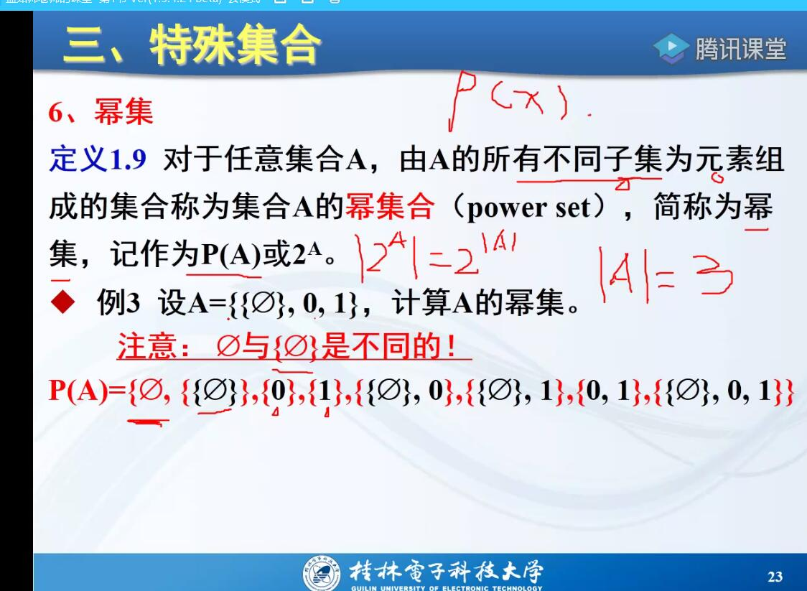

$A=\lbrace x|x\in R,x^2<0 \rbrace,$则$A=\varnothing$
$A=\lbrace x|x\in R,x^2+1<0 \rbrace,$则$A=\varnothing$
$B=\lbrace\varnothing\rbrace,|B|=1$
$|\varnothing|=0,|\lbrace\varnothing\rbrace|=1$
空集也是一个集合，空集也可以看作是集合 A 的元素

#### 3.3 全集

- 针对一个具体范围，我们考虑的所有对象的集合叫**全集**,记作$U$或$E$.
- 在文氏图一般使用**方形**表示全集

在立体集合中，全集就是空间中所有的点

**注**:全集是相对唯一的。也就是相对于一个事物而言的
e.g:听课的学生是相对于学校所有的学生的

#### 3.4 幂集

- 对于任意集合$A$，由$A$的所有不同子集为元素组成的集合称为集合 A 的幂集合，幂集，记作$P()或2^A$。(相当于把集合 A 所有的子集全部组成一个集合)
- 幂集也叫集合的集合，对于数学方面、知识库和表处理语言以及人工智能方面有重要意义
  $P(A)=\lbrace x|x\subseteq A\rbrace$
  关系:$|2^A|=2^{|A|}$、$|A|=n,|P(A)|=2^n$

**e.g**
$A=\lbrace a,b,c\rbrace,B=\lbrace \color{red}{a},\color{blue}{\lbrace b,c\rbrace}\color{black}{\rbrace}$求他们的幂集
$P(A)=\lbrace\varnothing,\lbrace a\rbrace,\lbrace b\rbrace,\lbrace c\rbrace,\lbrace a,b\rbrace,\lbrace a,c\rbrace,\lbrace b,c\rbrace,\lbrace a,b,c\rbrace\rbrace$
$P(B)=\lbrace\varnothing,\lbrace a\rbrace,\lbrace \lbrace b,c\rbrace\rbrace,\lbrace a,\lbrace b,c\rbrace\rbrace\rbrace$

$P(\varnothing),2^0=1$
$P(P(\varnothing)),2^1=2$
$P(P(P(\varnothing))),2^2=4$
$P(P(P(P(P(\varnothing))))),2^4=16$
**注:一定要写空集，因为空集是任意集合的子集**

#### 3.5 补集

- 对于任意集合$A$和全集$U$，由所有属于全集$U$但不属于 A 的元素组成的集合称为集合 A 的补集，记作$~A$或$\overline{A}$

### 4.集合相等关系

#### 4.1 元素基本特性

- 集合中的元素是**无序**的。$\lbrace 1,2,3,4\rbrace与\lbrace 2,1,3,4\rbrace$相同
- 集合中的元素是**不同**的。$\lbrace 1,2,2,3,4\rbrace与\lbrace 1,2,3,4\rbrace$相同

设$E=\lbrace x|(x-1)(x-2)(x-3)=0,x\in R\rbrace,F=\lbrace x\in Z^+,x^2<12\rbrace$可见 E 和 F 具有相同的元素$\lbrace 1,2,3\rbrace$,此时两个**集合相等**

#### 4.2 外延性原理(外延公理)

两个集合$A$和$B$**相等**，当且仅当他们**元素完全相同**，记为$A=B$，否则$A$和$B$**不相等**，
记为$A\not={B}$

### 5.集合包含关系

设$A=\lbrace BASIC,PASCAL,ADA\rbrace,B=\lbrace ADA,PASCAL\rbrace$
此时$A$中含有$B$中的元素，则这种情况称为$A包含B$

设$A,B$为任意两个集合

- 如果 B 的每一个元素都是 A 中的元素，则称 B 是 A 的子集，也称作 B 被 A 包含或 B 包含于 A 或 A 包含 B，记作$B\subseteq A$，否则记作$B\nsubseteq A$
  **“$\subseteq 包含于,\supseteq 包含$”**
- 如果$B\subseteq A$并且$A\not ={B}$,则称 B 是 A 的真子集，也称做 B 被 A 真包含或 A 真包含 B，记作$B\subset A$，否则记作$B\not\sub A$

$“\subseteq”关系的数学语言描述为:B\subseteq A\iff 对\forall x,如果x\in B,则x\in A$(在小部分推在大部分)

**空集是任意集合 A 的子集
任意集合 A 是全集的子集**

隶属——元素和集合之间 （用属于）
包含——集合和集合之间 （用包含）

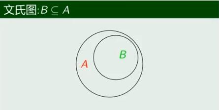
$
不改变包含关系，B最小可以达到空集，最大可以与A相等
\begin{cases}
\varnothing\subseteq A \\
A\subseteq A
\end{cases}
$

理解:

- 包含与真包含:包含可以包括自己本身，真包含不包括自己本身
- 子集和真子集:子集是包括所有的子集，真子集是除了自己本身的子集
  $B\subseteq A且A\not ={B}$
- 空集没有真子集，没有真包含
- 空集是空集的子集，空集包含空集

已知$A=\lbrace 1,2,3,4\rbrace,B=\lbrace 1,2,4\rbrace,C=\lbrace 2,3\rbrace,D=\lbrace 3,2\rbrace$

1. $A\subseteq A,B\subseteq A,C\subseteq A,D\subseteq A$
2. $C\subseteq D,D\subseteq C$,同时,$C=D$(证明集合相等)

#### 5.1 证明集合相等

设$A,B$为任意两个集合,则$\color{red}{A}=B\color{black}{\lrArr}\color{blue}{A\subseteq B并且B\subseteq A}$
**$\color{red}{\star\star\star上面的定理非常重要，证明集合相等的有效方式}$**
证明不相等举出特例即可。

#### 5.2 证明框架

$\color{red}{证明：}$

1. 首先证明$A\subseteq B:\forall x\in A,...,x\in B \therefore A\subseteq B$
2. 其次证明$B\subseteq A:\forall x\in B,...,x\in A \therefore B\subseteq A$
   由以上两点，可知$A=B$

#### 5.3 n 元集的子集

e.g.设$A=\lbrace a,b,c\rbrace$,求出 A 的所有子集
**解:**
$\because |A|=3,$
$\therefore$A 的子集可能包含的元素个数 $m=0,1,2,3$
$m=0$，即没有任何元素，也就是空集$\varnothing$
$m=1$，从 A 中任取$1$个元素，则有$C_3^1=3$个$:\lbrace a\rbrace,\lbrace b\rbrace,\lbrace c\rbrace$
$m=2$，从 A 中任取$2$个元素，则有$C_3^2=3$个$:\lbrace a,b\rbrace,\lbrace a,c\rbrace,\lbrace b,c\rbrace$
$m=3$，从 A 中任取$3$个元素，则有$C_3^3=1$个$:\lbrace a,b,c\rbrace$
以上 8 个集合就是 A 的所有子集

$\color{red}{\star}$推广:对于任意$n$元素集合$A$，它的$m$元$(0\leqslant m\leqslant n)$子集个数为$C_n^m$个，所以不同的子集个数为:
$C_n^0+C_n^1+···+C_n^n=(1+1)^n=2^n$

### 6.集合运算

#### 6.1 并运算

设$A,B$是两个集合，则集合$A$与$B$的**并集**定义为:
$$A \cup B=\lbrace x|x\in A 或 x\in B\rbrace$$

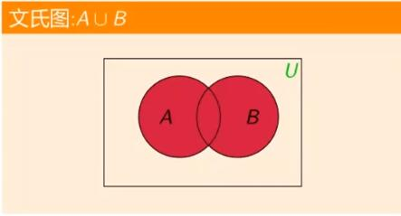

e.g $\lbrace1,3,5\rbrace,\lbrace1,2,3\rbrace$的并集是$\lbrace1,2,3,5\rbrace$

#### 6.2 交运算

设$A,B$是两个集合，则集合$A$与$B$的**交集**定义为:
$$A \cap B=\lbrace x|x\in A 并且 x\in B\rbrace$$

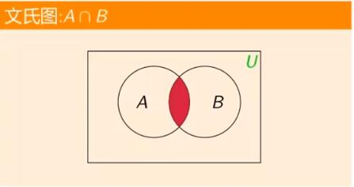

e.g $\lbrace1,3,5\rbrace,\lbrace1,2,3\rbrace$的交集是$\lbrace1,3\rbrace$

#### 6.3 补运算

设$U$是全集，则集合$A$的**补集**定义为:
$$\overline{A}=\lbrace x|x\notin A\rbrace$$

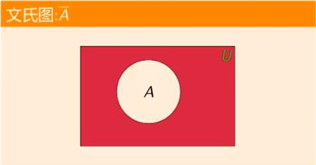

e.g $\lbrace1,3,5\rbrace$对于全集$\lbrace1,2,3,4,5,6,7,8,9\rbrace$的并集是$\lbrace2,4,6,7,8,9\rbrace$

#### 6.4 差运算

设$A,B$是两个集合，则集合$A$与$B$的**差集**定义为:
$$A - B=\lbrace x|x\in A 并且 x\notin B\rbrace$$
(可以理解为减去了 B 的部分和 A 与 B 公共的部分，一种相对补集)
(也就是相对于 B 的一种补运算)
(**减去了大家都有的部分和 B 的部分**)
(减去**自己本身和共有**的元素)
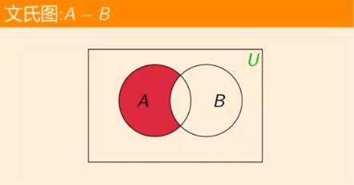

e.g $\lbrace1,3,5\rbrace,\lbrace1,2,3\rbrace$的差集是$\lbrace 5\rbrace$

#### 6.5 对称差运算

(也叫异或运算，或的相反)
设$A,B$是两个集合，则集合$A$与$B$的**对称差集**定义为:
$$A\oplus B=\lbrace x|(x\in A并且x\notin B)或(x\notin A并且x\in B)\rbrace$$
(可以理解为去掉了两者共同具有的元素的部分剩下来的)

e.g $\lbrace1,3,5\rbrace,\lbrace1,2,3\rbrace$的对称差集是$\lbrace 2,5\rbrace$

#### 6.6 运算拓展

**连并集**：
设$A_1,A_2,A_3,···,A_n$是$n$个任意集合，则这$n$个集合的并集是包含那些**至少是这组集合中一个集合成员的元素**的集合
$$\bigcup_{i=1}^nA_i=A_1\cup A_2\cup ···\cup A_n=\lbrace x|x\in A_1 或者x\in A_2···或者 x\in A_n\rbrace$$

**连交集**：
设$A_1,A_2,A_3,···,A_n$是$n$个任意集合，则这$n$个集合的交集是包含那些**属于这组集合中所有成员的元素**的集合
$$\bigcap_{i=1}^nA_i=A_1\cap A_2\cap ···\cap A_n=\lbrace x|x\in A_1 并且x\in A_2···并且 x\in A_n\rbrace$$

e.g $A=\lbrace 0,2,4,6,8\rbrace,B=\lbrace 0,1,2,3,4\rbrace,C=\lbrace 0,3,6,9\rbrace$
$A\cup B\cup C=\lbrace 0,1,2,3,4,6,8,9\rbrace$
$A\cap B\cap C=\lbrace 0\rbrace$

#### 6.7 集合运算定律

设$U$为全集，$A,B,C$为任意集合。

1. $$A\cup A=A,A\cap A=A \tag{幂等律}$$
2. $$A\cup B=A\cup B,A\cap B=B\cap A,A\oplus B=B\oplus A\tag{交换律}$$
3. $$
    \begin{cases}
    A\cup(B\cup C)=(A\cup B)\cup C\\A\cap(B\cap C)=(A\cap B)\cap C\\(A\oplus B)\oplus C=A\oplus (B\oplus C)
   \end{cases}\tag{结合律}$$
4. $$A\cup\varnothing=A,A\cap U=A\tag{同一律}$$
5. $$A\cup U =U,A\cap\varnothing=\varnothing\tag{零律}$$
6. $$
   \begin{cases}
   A\cup(B\cap C)=(A\cup B)\cap(A\cup C)\\
   A\cap(B\cup C)=(A\cap B)\cup(A\cap C) \\
   \end{cases}\tag{分配律}$$
7. $$A\cup(A\cap B)=A,A\cap(A\cup B)=A\tag{吸收律}$$
8. $$\overline{A}\cap A=\varnothing,\overline{A}\cup A=U\tag{矛盾律和排中律}$$
9. $$\overline{\overline{A}}=A\tag{双重否定律}$$
10. $$\overline{A\cup B}=\overline{A}\cap\overline{B},\overline{A\cap B}=\overline{A}\cup\overline{B}\tag{德摩根律}$$
11. $$\overline{\varnothing}=U,\overline{U}=\varnothing\tag{余补集}$$

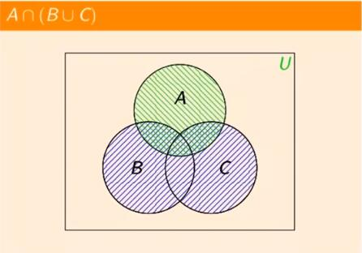
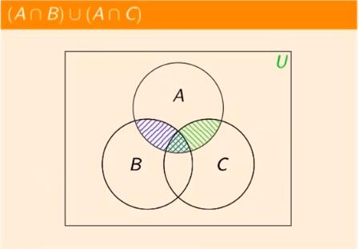

利用大部分和小部分的关系可以很好的理解
小部分并大部分得大部分，小部分交大部分得小部分
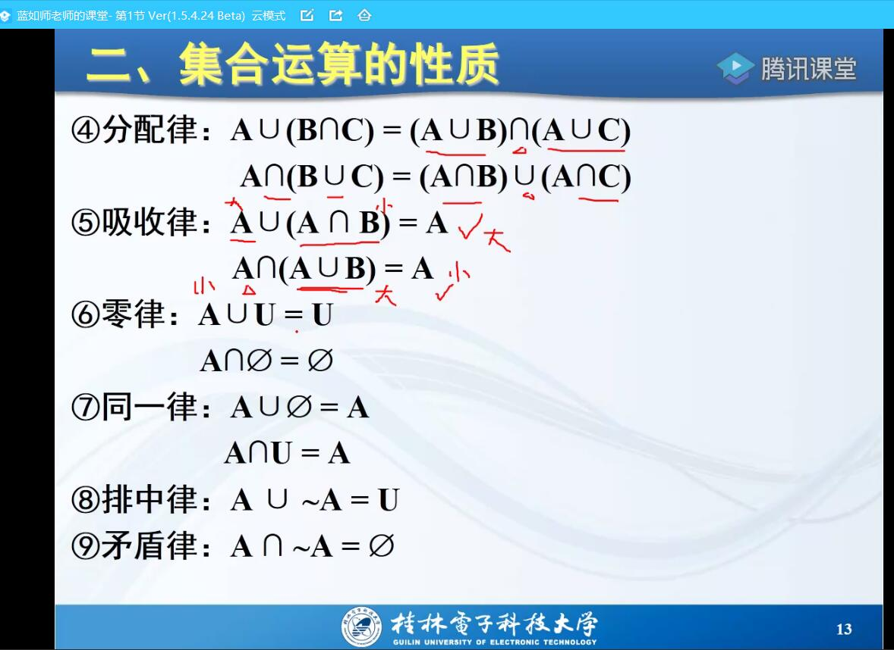

#### 6.8 证明集合包含

$B\subseteq A\lrArr \forall x\in A,x\in B$

$\star\star e.g$ 证明德摩根律的等式之一:$\overline{A\cup B}=\overline{A}\cap\overline{B}$

证明：

1. 首先证明:$\overline{A\cup B}\subseteq\overline{A}\cap\overline{B}$
   $\color{blue}{\forall x\in\overline{A\cup B}}\color{black}{}\rArr x\notin A\cup B$
   $\rArr x\notin A并且x\notin B$
   $\rArr x\in\overline{A}并且x\in\overline{B}\color{blue}{\rArr x\in\overline{A}\cap\overline{B}}$

2. 其次证明:$\overline{A}\cap\overline{B}\subseteq\overline{A\cup B}$
   $\color{blue}{\forall x\in\overline{A}\cap\overline{B}}\color{black}{\rArr x\in\overline{A}并且x\in\overline{B}}$
   $\rArr x\notin A并且x\notin B$
   $\rArr x\notin A\cup B\color{blue}{\rArr x\in \overline{A\cup B}}$
   由以上两点，可知等式$\overline{A\cup B}\subseteq\overline{A}\cap\overline{B}$成立

##### 6.8.1证明

1. 以集合定义为基础
2. 以已经得到证明的基本定律为基础，利用**集合演算**

### $\color{red}{\star}$7.容斥原理

- $$|A\cup B|=|A|+|B|-|A\cap B|$$
- $$|A\cup B\cup C|=(|A|+|B|+|C|)-(|A\cap B|+|A\cap C|+|B\cap C|)+|A\cap B\cap C|$$
- $$|A_1\cup A_2\cup A_3\cup\cdots\cup A_n|=\sum^n_{i=1}|A_i|-\sum_{i\not ={j}}|A_i\cap A_j|+|\sum_{i\not ={j}\not ={k}}|A_i\cap A_j\cap A_k|+\cdots+(-1)^{n+1}|A_1\cap A_2\cap A_3\cap\cdots\cap A_n|$$

## $\color{red}{\star}$集合论基础——关系

### 1.序偶定义与笛卡尔积

#### 1.1定义

- 两个元素**按一定次序排列**的二元组，称为**序偶**，记作$<x,y>$，$x$称为**第一元素**或前元素，$y$称为**第二元素**或后元素。
- 对于任意两序偶$<a,b>,<c,d>$，当且仅当$a=c,b=d$时，**两序偶相等**，否则**不等**
- 以此类推可以推广值n元序偶

$e.g：$
$<1,2>,<校长，主任>\cdots$
张明喜欢离散数学可以表示为：
$<张明,离散数学>$
英语课本在书桌上表示为:
$<英语课本,书桌>$
若序偶$<x+y,2y-1>=<3y-4,5>$则$x+y=3y-4,2y-1=5$,得$x=2,y=3$

#### 1.2序偶性质

- 一个序偶两个前后两元素不相同，不能交换次序，称为**次序性、有序性**
**注：这个也可以说明事物之间的关系都是有顺序性的**

#### 1.3笛卡尔积

设$A,B$是两个集合，称集合$A\times B=\lbrace<x,y>|x\in A且y\in B\rbrace,$为集合$A$与$B$的**笛卡尔积**
推广：
对于$n$个集合$A_1,A_2,...,A_n$
$A_1\times A_2\times\cdots\ ...\times A_n=\lbrace<a_1,a_2,\cdots,a_n>|a_i\in A_i\rbrace$

$e.g$：
令$A$为某大学所有学生的集合，$B$为某大学开设的所有课程，则$A\times B$可以表示该校学生选课的所有可能情况
集合$A=\lbrace 1,2\rbrace,B=\lbrace a,b,c\rbrace$
则$A\times B=\lbrace <1,a>,<1,b>,<1,c>,<2,a>,<2,b>,<2,c>\rbrace$,
$B\times A=\lbrace <a,1>,<a,2>,<b,1>,<b,2>,<c,1>,<c,2>\rbrace$

#### 1.4笛卡尔积性质

- 集合$A$为$\varnothing$，那么$A\times B=\varnothing$
- 对任意两个集合$A,B$,则不一定有$A\times B=B\times A$,**不满足交换律**($A=B或A中有一个是\varnothing时成立$)
- 对任意三个集合$A,B,C$,不一定有$A\times (B\times C)=(A\times B)\times C$**不满足结合律**(当$A,B,C中有一个是\varnothing满足交换律$)
- $A\times B=\varnothing$,当且仅当$A=\varnothing 或B=\varnothing;$
- 集合$A,B$为有限集时,$|A\times B|=|B\times A|=|A|*|B|$
- 笛卡尔积对并运算和交运算满足分配律
  $A\times(B\cup C)=(A\times B)\cup(A\times C)$
  $A\times(B\cap C)=(A\times B)\cap(A\times C)$
  $(A\times C)\cup(B\times C)=(A\cup B)\times C$
  $(A\times C)\cap(B\times C)=(A\cap B)\times C$

$e.g$
$A=\lbrace a\rbrace,B=\varnothing$,则$A\times B=B\times A=\varnothing$

**笛卡尔积算法理解**:就是任意集合$A,B$,相当于从$A$中取出元素作为序偶的第一元素，从$B$中取出元素作为序偶的第二元素，并逐个排列

### 2.关系

#### 2.1关系的定义

- 如果集合全体元素都是**序偶**(**所以是建立在笛卡尔积的基础上**，因为笛卡尔积的所有元素都是序偶)，则称集合为一个**二元关系**，记作$R$。
- 对于某二元关系$R$，若$<x,y>\in R$，则称$x$与$y$以$R$**相关**，记作$xRy$.
  如果$<x,y>\notin R$,则称$x$与$y$**不相关**，记作$x\not R y$
- 设$A,B$任意集合，将$A\times B$的任意子集$R$称为$A$到$B$的一个**二元关系**，简称**关系**。

$$
\begin{cases}
1.当A=B时(即R\subseteq A\times A)，则称R为A上的二元关系 \\
2.当A\not ={B}时(即R\subseteq A\times B)，则称R为集合A到集合B的二元关系\end{cases}
$$

- 对任意集合$A$，空集$\varnothing$称为$A$上的**空关系**
- 关系$E_A=\lbrace <x,y>|x\in A,y\in A\rbrace$称为$A$上的**全域关系**
- 关系$I_A=\lbrace <x,x>|x\in A\rbrace$称为$A$上的**恒等关系**
- 以此类推可以推广到$n$元
- 求集合A到B的**所有不同关系**，相当于找笛卡尔积中所有不同的**子集**，即**求幂集**

$e.g:$
假设$A=\lbrace a,b\rbrace,B=\lbrace c,d\rbrace$

$\color{red}{\star}$理解：

1. 关系就是找**笛卡尔积中的子集**(**$关系=笛卡尔积的子集$**)，如果这个关系是笛卡尔积的子集，则关系$R$就是定义在笛卡尔积(而这个笛卡尔积**又是由两个集合得到**，所以才有**集合A到B的关系**)的关系(例如有集合$A,B$，如果关系$R\subseteq A\times B$,则$R$是笛卡尔积上的子集，那么$R$就是定义在集合$A$到集合$B$上的关系。再有$A=B$的情况下，那么称$R$就是$A$上的关系)
2. 如果有一个序偶$<x,y>\in R$,则称$x$与$y$以$R$相关
3. $\color{red}{\star}$**笛卡尔积表示了该关系的所有可能情况，笛卡尔积的子集表示了不同的关系，真正符合的关系则是他的子集**
4. $\color{red}{\star}$$A$到$B$的关系，是指$A$和$B$的关系，而$A$上的关系，是指$A$和$A$的关系，也就是自己
5. 关系作用于对象

理解：将事物间的各种联系抽象成关系，A与B的相互作用。
将**关系**刻画成一个**序偶**的集合

$\color{red}{\star}$技巧：写笛卡尔积时可以像写矩阵那样，如：$A={\lbrace a_1,...,a_n\rbrace},B={\lbrace b_1,...,b_m\rbrace},A\times B$可以把$a_1,...a_n$分别写到第$1,...,n$行，写在序偶的第一元素位,把$b_1,...,b_m$分别写到第$1,...,m$列，写在序偶的第二元素位，就不容易漏了(有多少列就写多少列)(可以理解为$n\times m的矩阵$)

#### 2.2关系的基数

- 设$A$集合基数为$m$，$B$集合基数为$n$，集合$A\times B$的基数为$m\cdotp n$
  $|A|=m,|B|=n --> |A\times B|=m\cdotp n$
- 集合$A\times B$的子集有$2^{m*n}$个，即$A$到$B$的关系有$2^{m*n}$个
  即$P(A\times B)=2^{m*n}$
- 设A集合基数为$m$，集合$A\times A$的基数为$m*m$
  $|A|=m -->|A\times A|=m*m$
- 集合$A\times A$的子集有$2^{m*m}$个，即A上的关系有$2^{m*m}$个。
  即$P(A\times A)=2^{m*m}$

#### 2.3关系的范围

- 第一元素组成的集合称为**定义域**
- 第二元素组成的集合称为**值域**
- 定义域和值域的并集叫**域**
  $dom R = \lbrace x|存在y满足<x,y>\in R\rbrace$
  $ran R = \lbrace x|存在y满足<y,x>\in R\rbrace$
  $fld R = dom R\cup ran R$

#### 2.4关系的表示

- 集合法(相当于叙述法)
- 关系图
- 关系矩阵
 对于从A到B的关系，设$A=\lbrace a_1,a_2,...,a_n\rbrace$,$B=\lbrace b_1,b_2,...,b_m\rbrace$,A中的元素为行序标，B中的元素为列序标的矩阵$M_R=(r_{ij})_{n\times m}$为关系矩阵

$$r_{ij}=
\begin{cases}
1 & <a_i,b_j>\in R\\
0 & <a_i,b_j>\notin R
\end{cases}
$$

对于A上的关系R，设$A=\lbrace a_1,a_2,...,a_n\rbrace$，以A中的元素为行、列序标的矩阵$M_R=(r_{ij})_{n\times m}$为关系矩阵

$$r_{ij}=
\begin{cases}
1 & <a_i,a_j>\in R\\
0 & <a_i,a_j>\notin R
\end{cases}
$$

$\color{red}{\star}$从$A$到$B$的(??关系)理解：($x$是$A$中的，$y$是$B$中的)
?? = 包含 -> $x\subseteq y$
?? = 真包含 -> $x\subset y$
?? = 整除 -> $x 整除 y$
?? = 小于 -> $x<y$

#### 2.5关系的性质

- 对于集合$A$上的关系$R$，如果任意元素$x\in A$，都有$<x,x>\in R$，那么称集合$A$上$R$具有**自反性**，若$<x,x>\notin A$，则具有**反自反性**。
  $\color{red}{\star}$**特征：关系矩阵自反主对角线为1，反自反主对角线为0。关系图自反都有自环，反自反都没有自环**
- 对于集合$A$上的关系$R$，如果任意元素$x\in A和y\in A$，都有$<x,y>\in R,<y,x>\in R$，则称集合$A$上关系$R$具有**对称性**，若$x=y$时，$<x,y>\in R,<y,x>\in R$，则具有**反对称性**(反过来说，当$<x,y>\in R,<y,x>\notin R$或，$<x,y>\notin R,<y,x>\in R$时是反对称的，也就是其中一个关系属于R另一个不属于)
  **特例:同时有对称性和反对成称性的是恒等关系**
  **特征:**关系矩阵**具有对称性**的矩阵为**对称矩阵**，**具有对反对称性**关系矩阵中$r_{ij}和r_{ji}$不同时为0。关系图中具有**对称性**的**有去有回，都有自环**，具有**反对称性**，任何一个节点**至多有一条边**。即对称也反对成称关系矩阵为单位阵，关系图只有自环。
- 对于集合$A$上的关系$R$，如果任意元素$x\in A,y\in A,z\in A$，如果$<x,y>\in R且<y,z>\in R$,则称集合$A$上$R$具有**传递性**。

自反：
$e.g:$
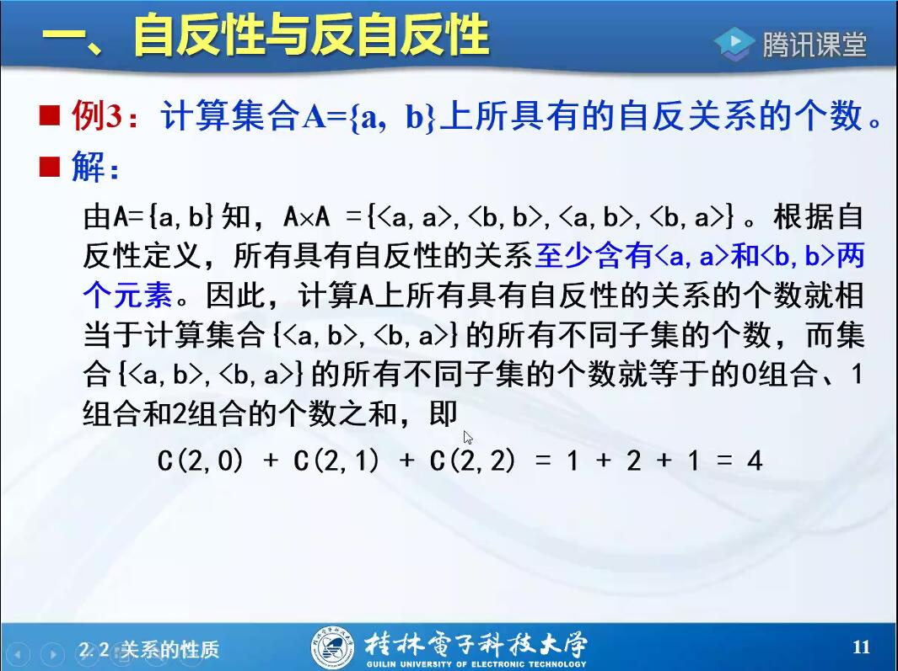
实际就是要找含有$<a,a>,<b,b>$的关系，在满足两个都有的基础上再放0,1,2个元素的个数
$C_2^0$:再放0个元素|$C_2^1$:再放1个元素|$C_2^2$:再放2个元素
$C_2^0+C_2^1+C_2^2=1+2+1=4$
相当于计算$<a,b>,<b,a>$所有不同子集的个数
反自反个数呢？
**举例：同姓关系**
**自己跟自己的关系**

对称：
$e.g:$
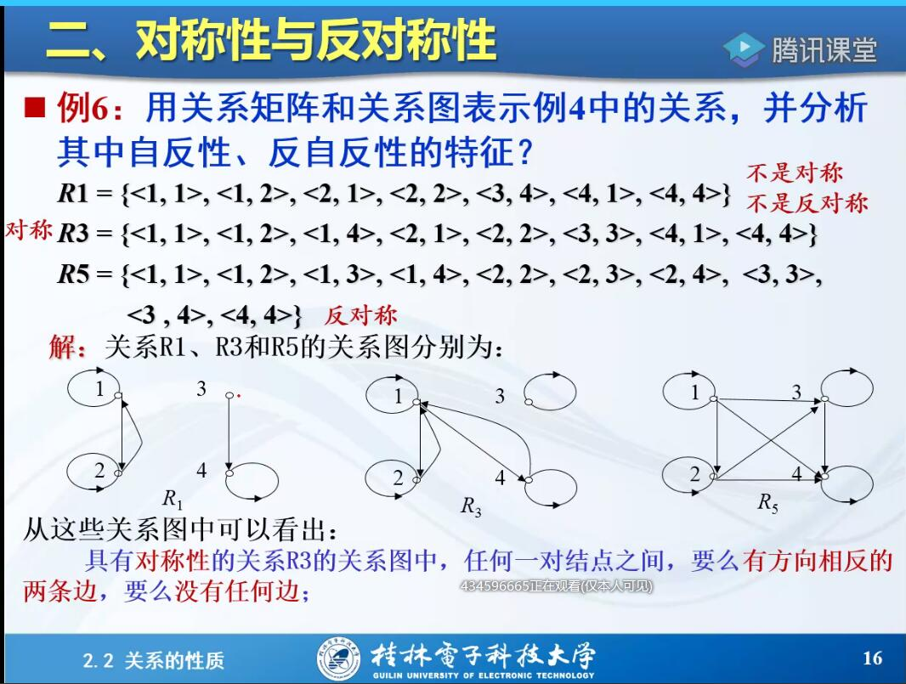
**举例：同学关系、朋友关系**
**反过来也是同样的关系**

传递：
**注意：当前提条件不满足的时候当成有传递性**
因为虽然只有一个序对，但它没有**违反传递性的规则**，故也是**传递**的。
$e.g:R=\lbrace <3,4>\rbrace$
因为根据定义这个有$<3,4>\in R$，但没有$<y,z>\in R$此时，$<y,z>\in R$为$0$值，导致蕴含式前件为假，说明传递性自然成立([前件为假，整个命题为真](https://www.zhihu.com/question/21807687/answer/812545192))

关系图：首尾相连形成闭合的环
关系矩阵：$r_{ij}=1且r_{jk}=1$，则有$r_{ik}=1$

$\color{red}{\star}$**总结：**
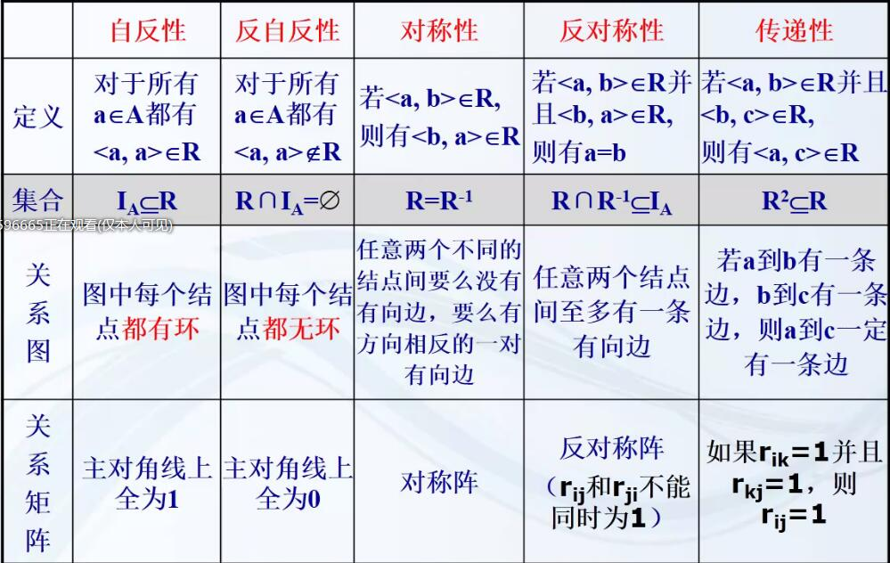

- 自反与反自反

  1. 存在**既不是自反也不是反自反**的关系
  2. 关系$R$<u>自反</u>，则充要条件是**关系图**中每个节点**都有自环**，关系$R$<u>反自反</u>，则充要条件是**关系图**中每个节点都**没有自环**
  3. 关系$R$<u>自反</u>，则充要条件是**关系矩阵**中主对角线都为$1$，关系$R$<u>反自反</u>，则充要条件是**关系矩阵**主对角线上为$0$
  4. 不符合2和3的两个条件的则**既不是自反也不是反自反**
  5. 特殊:非空集合上的空关系是反自反的，空集合上的空关系是自反的
  技巧：只看元素相同的是否全都有或全都没有就行

- 对称与反对称
 技巧：1.只要当前所给关系全都满足对称那就是对称，全都是只有对称的一半就是反对称，形如$<x,x>$的都是既对称又反对成称找的时候可以不用管。2.**反对称一定不能出现对称** （除$<x,x>$）3.**对称一定要全都满足**

- 传递
 技巧：找的时候就往这个**关系集合**里面**没有的元素**去找
 如：$R_2=\lbrace <1,1>,<3,3>,<2,3>,<3,2>,<2,1>,<1,2>,<3,1>,<1,3>\rbrace$则该集合没有$<2,2>$那就在传递的时候往$<2,2>$上凑，这里可以看$<2,3>,<3,2>$(**只要能够形成传递的序偶都能传递就是传递**)

#### 2.6关系性质判定定理

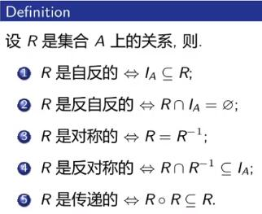

#### 2.7关系的运算

（因为关系是集合，所以集合运算都适用。类似于面向对象的概念）
与面向对象的相似
$\begin{cases}集合（父类）\\ 关系（子类）\end{cases}$
父类有的子类都有(所以关系的运算都符合集合的运算)

疑问：什么是前件？对称是只要关系集合里面的序偶满足了对称就可以了吗？

在假言命题中，表示条件的命题称为前件（一般用“p”表示），表示依赖条件而成立的命题称为后件（一般用“q”表示）。在充分条件假言命题中，联结词“如果”后的支命题是前件，“那么”后的支命题是后件。

1、肯定前件就要肯定后件，否定后件就要否定前件。
2、否定前件就要否定后件，肯定后件就要肯定前件。

---

关系运算可以由已有的关系产生新的关系

关系是**特殊的集合**，关系也满足所有的**基本运算**（交并补差），满足同样的**运算定律**
关系也有自己独特的运算

1. **复合运算**(对应**传递性**)
类似传递但不是传递

$\color{red}{\star}$**理解:两个关系通过传递来合成的关系。找$R\circ S$，实际上就是找$R$和$S$的传递关系**(**传递关系**)。
也就是$A$到$C$可以借用中间关系$B$来作为桥梁
（两个集合传到第三个集合）

- 设$A,B,C$三个集合，$R$是从$A$到$B$的关系，$S$是从$B$到$C$的关系($R:A\rightarrow B,S:B\rightarrow C$)，则可以定义$R$和$S$的**复合关系**为**集合$A$到集合$C$的关系**，记作$R\circ S$,$R\circ S=\{<x,z>|x\in A,z\in C且存在y\in B,使得<x,y>\in R且<y,z>\in S\}$,"$\circ$"为复合运算。

$e.g:$
设$A=\{a,b,c,d\},B=\{b,c,d\},C=\{a,b,d\},R=\{<a,b>,<c,d>,<b,b>\},S=\{<d,b>,<b,d>,<c,a>\}$，$R$是$A$到$B$的关系，$S$是$B$到$C$的关系，则$R\circ S=\{<a,d>,<c,b>,<b,d>\}$
理解：$<a,b>(R),<b,d>(S)\rarr<a,d>$

**关系图和关系矩阵形式：**
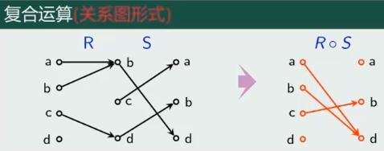
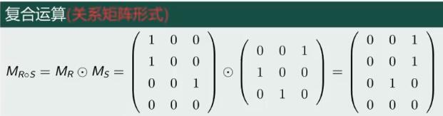
**关系矩阵中布尔积计算类似于矩阵乘法(超过1都当1)**

总结：
集合：找到**所有**满足$<x,y>\in R并且<y,z>\in S$的关系，来得到$<x,z>\in R\circ S$
关系图：将$R，S$的关系图画在一起，找到**所有首尾相连**的有向边，**再去掉中间节点可得**
关系矩阵：$M_R,M_S$进行**布尔积**运算，实际上就是**矩阵乘法**

2. **逆运算**(对应**对称性**)

- 设$A,B$三个集合，$R$是从$A$到$B$的关系，则从$B$到$A$的关系$R^{-1}=\{<x,y>|x\in B,y\in A,<y,x>\in R\}或R^{-1}=\{<b,a>|<a,b>\in R\}$(也就是说只要$<a,b>\in R$，则$<b,a>\in R^{-1}$)

$\color{red}{\star}$**逆运算与补运算的区别**：逆运算是直接将前后**两个元素调换**，而补运算是**找出不在$R$中的序偶**

逆运算**性质**：
$(R^{-1})^{-1}=R$
$\varnothing^{-1}=\varnothing$
$(A\times B)^{-1}=B\times A$

$e.g$
设$A=\{1,2,3,4\},B=\{a,b,c,d\},R是A到B的关系$
$R=\{<1,a>,<2,c>,<3,b>,<4,b>,<4,d>\}$
$R^{-1}=\{<a,1>,<c,2>,<b,3>,<b,4>,<d,4>\}$

**关系图和关系矩阵形式:**

总结：
关系图：**箭头反向**即可
关系矩阵：求原关系矩阵的**转置**
$R^{-1}$的定义域和值域是$R$的值域和定义域 $domR=ranR^{-1},ranR=domR^{-1}$
$|R|=|R^{-1}|$

3. **幂运算**

- 设$R$是一个集合$A$上的关系，$n$为自然数，则关系$R$的$n$次幂为$R^n$,表示了$R$多次自我复合的结果。
规定：$R^0=I_A,R^1=R,R^{n+1}=R^n\circ R$

幂运算性质：
$R^{m+n}=R^n\circ R^m,(R^n)^m=R^{nm}$(类似于实数幂运算)

$e.g$
设$R=\{<1,1>,<1,2>,<2,3>,<3,4>,<4,5>,<5,6>\}$定义在集合$A=\{1,2,3,4,5,6\},$求$R^n$
$R^1=R$
$R^2=R\circ R=\{<1,1>,<1,2>,<1,3>,<2,4>,<3,5>,<4,6>\}$
$R^3=R^2\circ R=\{<1,1>,<1,2><1,3>,<1,4>,<2,5>,<3,6>\}$
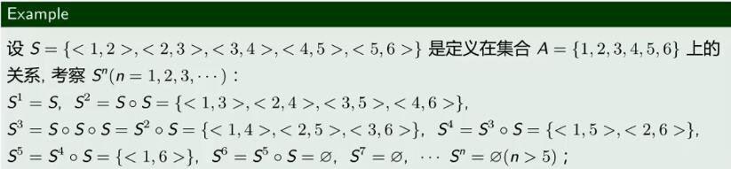

- $R^n$的基数并非随着$n$的增加而增加，而是逐渐**趋于定或递减**
- 当n>=|A|时，进行幂运算不会再增加新的序偶(幂运算收敛)
- 偶次幂相等，奇次幂相等

4. **闭包运算**

>要额外添加一些元素让原关系具有我们所需要的性质
在添加的同时**不能大程度的改变原关系**，只能在最小限度上进行改变，避免过多地改变关系$R$
**添加元素，添加完后要满足原定义才是最小程度的改变**
>对一个关系$R$进行添加一次，就变成$R'$
对一个关系$R$进行添加$n$次，就变成$R^{(n)}$

$\color{red}{\star}$关系闭包问题:如何在给定关系中**添加最少的元素**，使其**具有某种性质**。（添加元素无法得到反自反和反对成称）不考虑删除

---

- 设$R$是集合$A$上的关系，若存$A$上的关系$R'$则：
  1. $R'$是**自反**的(**对称的或传递的**)
  2. 对**任何自反**(**对称的或传递的**)的关系$R''$($R''$为任意一个满足自反、对称或传递的)，如果$R'\subseteq R''$,则称$R'$为$R$的**自反闭包**(**对称闭包或传递闭包**),记为$r(R)$($s(R)$或$t(R)$)

$e.g$
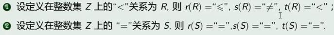
**闭包求解**:

- 集合：添加没有的元素
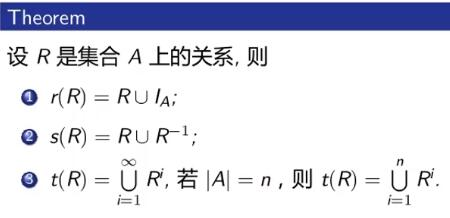
**公式理解**：
 $r(R)=R\cup I_A$:根据**自反的定义**，把**符合自反定义**的元素补充到$R$中，$I_A$根据**自反的定义**，是**符合自反的**
 $s(R)=R\cup R^{-1}$:根据**对称的定义**，把**符合对称定义**的元素补充到$R$中，$R^{-1}$根据**逆运算的定义**，是**符合对称**的(也是吻合对称的定义)(因为**逆运算**类似对称的定义才这样用)
 当$|A|=n,t(R)=\bigcup^n_{i=1}R^i$:根据**传递的定义**，把**符合传递定义**的元素补充到$R$中，根据**幂运算的定义**，是**符合传递**的(也是吻合传递的定义)(因为**幂运算**类似传递才这样用)
**上述公式也是根据关系性质判定定理所得**

---

- 关系图：补充自环或添加与某条边方向相反的边或添加能使图连成首尾相连的环的。

- 关系矩阵：
自反：将主对角线上的0改成1
对称：改变最少的数量来达到对称
传递：利用传递关系矩阵特点改变

#### 2.8关系运算性质

- 复合运算
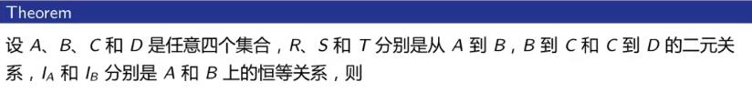

$$(R\circ S)\circ T=R\circ(S\circ T)\tag{结合律}$$$$I_A\circ R=R\circ I_B=R \tag{同一律}$$$$R\circ(S_1\cup S_2)=(R\circ S_1)\cup(R\circ S_2)$$$$(S_1\cup S_2)\circ T=(S_1\circ T)\cup(S_2\circ T)$$$$R\circ(S_1\cap S_2)\subseteq (R\circ S_1)\cap(R\circ S_2)$$$$(S_1\cap S_2)\circ T\subseteq (S_1\circ T)\cap(S_2\circ T)$$

- 逆运算
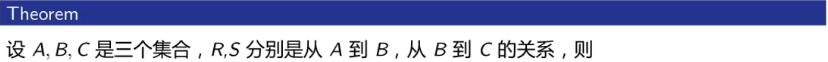

$$(R\circ S)^{-1}=S^{-1}\circ R^{-1}$$
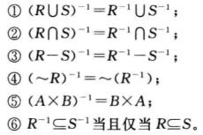

#### 2.9二元关系相等的证明方法

证明**关系相等**$\lrArr$证明**两个集合相等**
首先证$<x,y>\in R_1,...,<x,y>\in R_2,\therefore R_1\subseteq R_2$
再证$<x,y>\in R_2,...,<x,y>\in R_1,\therefore R_2\subseteq R_1$
根据关系运算的定义证明即可

### 3.特殊关系

#### 3.1等价关系

血缘关系不一定传递 （我和妈妈 妈妈和奶奶）（血缘关系是指直系的 我和爸爸）
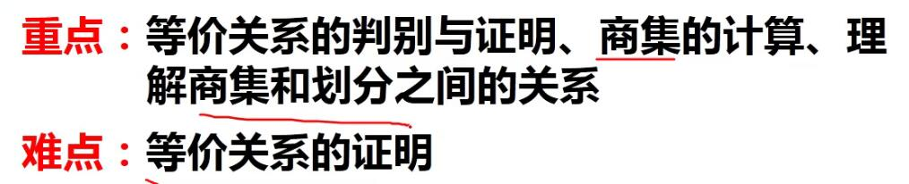

同时具备自反、对称、传递的关系
非空集合$A$来说，$A$上的等价关系与$A$的划分哪种更多？
{{a,b,c,d,e}} **全域关系**
{{a},{b},{c},{d},{e}} **恒等关系**
**等价关系个数=划分数**
A有3个元素 A上的关系等价关系有多少个？

- 设集合$A$上的关系$R$，$R$满足**自反、对称、传递性**，则R为等价关系

$e.g$
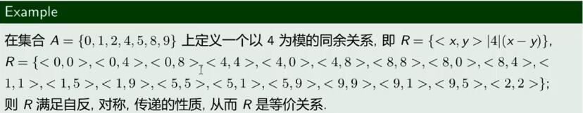
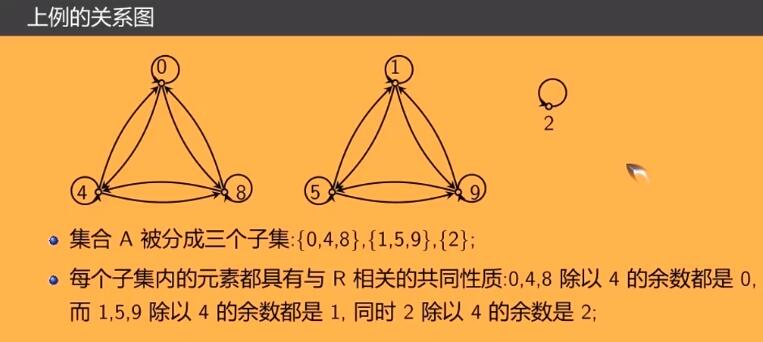
被分成的三个子集就是集合A的划分，也是等价关系R的商集

最熟悉的等价关系，就是 **等于**了。
不过等价关系，**不只可以说明 等于**，它其实是事物之间存在**同一性，一致性**的反应。它使得用有限的，**抽象的逻辑方法，理解 无穷的，纷繁复杂的具体事物成为可能。**
是人们对于世间万物产生理性思考之后，所产生的第一个具有**超越性意义的逻辑关系**。
其实就是发现了事物a 和 事物b 具有**一致性**。而这种一致性，是**可以重现的**（自反性），是**便捷而符合直觉的**（对称性），以及**可推广的，具有应用价值的**（传递性）
**等价关系是对等于的一个抽象化概念**

**等价类：**

- 设$R$是非空集合$A$上等价关系，对任意$x\in A$，称集合$[x]_R=\{y|y\in A且<x,y>\in R\}$为等价类。$x$称**生成元。**
**理解：**等价类中都是由任何一个跟$x$**有关**的元素来构成的等价类。
如上例中的等价类为
$[0]_R=[4]_R=[8]_R=\{0,4,8\}$
$[1]_R=[5]_R=[9]_R=\{1,5,9\}$
$[2]_R=\{2\}$

**等价类性质：**

1. $x\in A,[x]_R$是$A$的非空子集
2. $x\in A y\in A,如果<x,y>\in R$，则$[x]_R=[y]_R$
3. $x\in A y\in A,如果<x,y>\notin R$，则$[x]_R\cap[y]_R=\varnothing$
4. $\bigcup_{x\in A}[x]_R=A$

**商集:**
  
- 设$R$为非空集合上$A$的等价关系，由$R$确定的**一切等价类集合**称为集合$A$上关于$R$的商集，记作$A/R$，$A/R=\{[x]|x\in A\}$
**理解：**
就是由所有的等价类组成的一个集合，因为等价类也是集合，所以这个是集合的集合

**划分：**

- 给定非空集合$A$，设有集合$S=\{S_1,S_2,...,S_n\}$
满足以下条件：

1. $S_i\subseteq A,S_i\not ={\varnothing},i=1,2,..,m$
2. $S_i\cap S_j=\varnothing,i\not ={j},i,j=1,2,..,m$
3. $\bigcup_{i=1}^m S_i = A$
则称为集合$A$的**划分**，则$S_1,S_2,...,S_n$为这个划分的**块或类**

**同一个集合有多种不同的划分，不同的等价关系导出不同的划分。划分能唯一确定一个等价关系**
理解:
**这是对集合中的元素进行分组，对应于一种分类方式。**
分类我们可以**基于等价关系**来**进行分类就是对集合进行划分。**
e.g：鱼类分类 渔民撒网会打上来很多🐟 不同类别的🐟价钱不同，对这些种类不同的🐟进行分类。
我们一般采用机器分类的方式
高维神经网络中的子图寻找算法
**划分导出等价关系：**
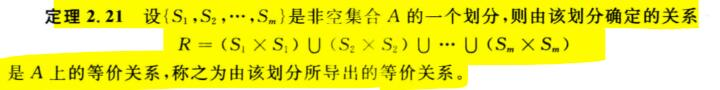

- **划分和商集之间的关系：**
一个**划分**能够确定一个唯一的**等价关系**。
对**等价关系**做**商集**能做成一个**划分**。
**划分也能够导出一个等价关系**(一对一的关系)
(因为商集的定义中用到的等价类的定义与划分的定义类似)
- **为什么引入商集和划分：**
因为划分能够将集合中**具有共同性质的元素进行分类**，变得更有序。能够灵活的找到两者之间的共同联系，并分类
- **为什么要引入等价关系:**
因为能方便地对集合进行**分类**

#### 3.2以n为模的同余关系

- 两个数被$n$能够整除，即余数为相同的两个数。同余关系也是等价关系。
- 记为$R=\{<x,y>|(x-y)/n\}$
