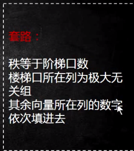
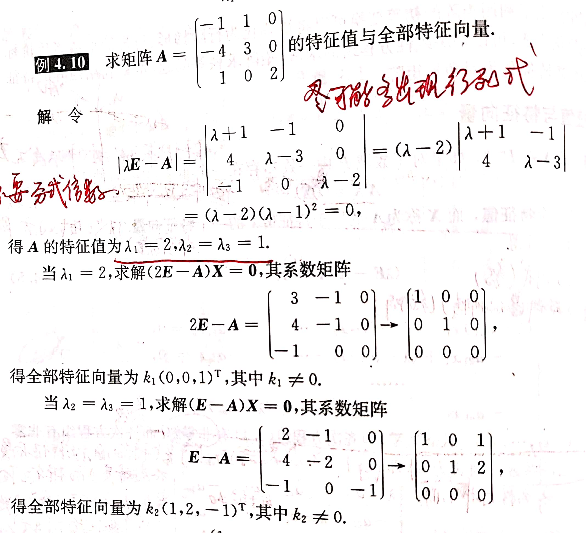

# 线性代数

## 矩阵

### 矩阵可逆

- AB=BA=E
- 推论：AB=E《==》可逆
- 先求矩阵的行列式，再求伴随阵，然后相乘
- 性质

### 矩阵行列式的性质

- |A^T|=|A|
- |kA|=k^n|A|
- |AB|=|A|*|B|
- 以上性质成立条件：A,B均为n阶方阵且同阶

### 矩阵初等变换

- 解线性方程组的过程中不能进行初等列变换（方程组不同解）

	- 方法：先化成行阶梯形矩阵，判断增广矩阵虚线左右两边非0行个数是否相等（相等就是有解），再判断非0行数是否等于未知量个数（相等就是有唯一解，非0行个数<未知量个数，则有无穷多解）

- 行阶梯形矩阵

	- 1.某行全为0→零行
	- 2.某行至少有一个不为0→非0行
	- 3.自左向右第一个不为0的元素→非0首元
	- 阶梯阵定义

		- (1)若有0行，则要位于底部（位于底部后就不在看这一行）
		- (2)每一个非0首元前面0元素个数逐行严格增加（递增，不能不变）
		- 最简行阶梯形矩阵

			- 是行阶梯形矩阵
			- 所有非零首元都是1
			- 所有的非0首元所在的列的其他元素都是0

	- 自由未知量

		- 所有解都能充当自由未知量
		- 选最简单那个当就可以了

	- 方法：与求行列式化成上三角形行列式方法类似，将阶梯以下的元素化成0，以及阶梯上的元素化成1，判断有解和唯一解，再倒过来从最后一个非0首元所在列的其他元素化成0
	- 注意：每做一步都要看是不是行阶梯形矩阵

- 初等行变换

- 等价

	- 自反性，自身等价
	- 对称性，A与B 《==》B与A
	- 传递性，A与B，B与C==》A与C

- 等价标准型

	- 化成分块矩阵的左上角为单位阵，其他子块均为0阵的矩阵
	- 方法：A经过行变换→行阶梯形矩阵→再经过行变换→最简行阶梯形矩阵→再经过列变换→等价标准型

		- 关键找0，用0最多的一列把其他列弄成0

### 初等矩阵

- 定义：经过一次初等变换的单位矩阵，任何矩阵都能变成单位阵
- 别法求逆

	- A方阵可逆，把A和同型的单位阵E并排写出，通过初等行变换将原来A的阵变成E，进而得出的另一边就是A的逆（(A,E)→初等行变换→(E,A^-1)）
	- 可逆阵可以直接化成单位阵

### 秩

- 定义：矩阵AmXn，若有一个r阶子式不为0，所有的r+1阶子式全为0，则r是矩阵的秩，记R（A）=r，(零矩阵的秩为0)

	- 最高阶非0子式的阶数为r

- An方阵可逆，R(An)=n

	- 因为可逆即为|An|！=0，即r阶子式！=0

- 结论

	- R(A)<=min{m,n}
	- R(A)>=1

- 求法

	- 一般矩阵求秩→化成行阶梯形矩阵求秩

		- 行阶梯形矩阵的秩=非0行个数

- 线性方程组判定

	- 非齐次

		- R(A)=R(A,b)有解

			- R(A,b)=r=n唯一解
			- R(A,b)=r<n无穷多解

		- R(A)<R(A,b)无解
		- 自由未知量

			- n-r=自由未知量
			- 自由未知量最后的解一定写C为任意常数

	- 齐次

		- R(A)=r=n有唯一解且为0解
		- R(A)=r<n无穷多解

- 矩阵的秩

	- 条件：有一个r阶的不为0，r+1阶全为0
	- 各种性质

		- R（A）=r <=> A的最高阶非零子式的阶数为r
		- A的大于r阶的子式均为0
		- R（A）< = min{r,v}
		- 若A是个零矩阵则R（A) = 0
		- n阶的方阵如果可逆其秩为n
		- 行阶梯形矩阵的非零行数=矩阵的秩
		- 初等变换不会改变矩阵的秩

### 向量的线性相关性

- 概念

	- 向量

		- 特殊矩阵

	- 分量

		- 矩阵内的元素

	- 向量组

		- 维数相同的向量构成的集合

- 线性表示

	- 若可以线性表示，则说明其k存在即等价于线性方程组有解
	- 有解→能线性表示
	- 无解→不能线性表示
	- 重要定理

		- 若A，B可以相互线性表示则称A，B等价

			- 等价的向量秩相同，但是秩相同的向量组不一定等价

		- B可由A线性表示<==> AX=B有解
		- AX=B有解<==>R(A)=R(A,B)

	- 组合系数

		- 设A:x1,x2...xn 有一组数k1,k2...kn 则k1x1+k1x2+....krxr就称为A的一个组合系数

- 线性相关

	- 定义： 设向量组A:x1,x2,x3... 若存在不全为0的数k1,k2...kr使得k1x1+k1x2+....krxr=0则A线性相关否则线性无关

		- 特例

			- 1. 二个向量组成的向量组若A是线性相关则分量对应成比例1
			- 2 一个向量形成的向量组若x=0则其是线性相关否则其是线性无关
			- 3 向量组中若有一个是0，则A必是线性相关的

	- 众多判定定理

		- 1.  向量A ：x1，x2....xn 线性相关<==>至少有一个ai可由其余向量线性相关
		- 2. 若向量A：x1，x2....xn线性相关<==> AX=0有非零解<==>R(A)<r

			- 推论 若向量A：x1，x2....xn线性无关<==>AX=0只有零解<==>R(A)=r 

		- 重要推论：

			- 1. 短无关，则长无关
			- 2. 长无关，则短无关
			- 3. m个n维向量构成的向量组，当m>n时，向量组线性相关 

- 向量组的极大无关组和秩

	- 套路

	- 极大无关组

		- 设  若向量A：x1，x2....xn的部分组，向量Ao：xi1，xi2....xir满足 1. 线性无关 2. 可以表示A中所有的向量，则称Ao是A的一个极大无关组
		- 特点

			- 不唯一
			- 向量组只有0向量则没有
			- 线性无关的向量组的极大无关组是其本身
			- 极大无关组与A等价
			- 任意极大无关组之间等价，且所含向量个数相同

	- 秩

		- 极大无关组所含向量的个数为向量组的秩

- 线性方程组解的结构问题

	- 基础解系

		- 是解向量的极大无关组
		- 特点

			- 线性无关
			- 方程组的解

	- 齐次线性方程组

		- 设：齐方AX=0 解集为S={ξ|Aξ=0}

			- 则 任意ξ1 ξ2  ∈S ==》 ξ1+ξ2∈S
			- 任意ξ∈ S 任意k∈R ==》 kξ 属于R

		- 定理

			- 设 $1,$2...$n-r 为 AX=0的一个基础解系，则其解的结构式为X=C1$1 + C2$2 +...... Cn$n

		- 求法

			- ①求最简--> ②写出同解方程组--> ③确认自由未知量--> ④自由未知量取特殊值找出特殊的解向量

		- 一个结论

			- 若ATA = 0和AX=0有相同的解，则它们的基础解析所含的解向量个数相等 ----> 例题！常考 

	- 非齐次线性方程组

		- 设非方AX=b的解集为T{η|Aη =b）}则

			- ① 任意η1，η2 ∈T ==》 η1-η2 ，满足AX=0 
			- ② 任意￥ ∈N（A)，Aη*+$) =b

		- 导出线性方程组

			- AX=0 称为AX=b的导出线性方程组

		- 定理

			- 设 AX=b 无穷多解 AX=0 的基础解析为1,2,3....   $X=η^* +c_1 +c_2+....$

		- 求法

			- 法 1 ① 求出特解 ② 求导出线性方程组基础解系 ③ 特解+导出线性方程组的通解
			- 法2 求解通解 --》 分解出向量和的形式

- 重要定理

	- 若A，B可以相互线性表示则称A，B等价

		- 等价的向量秩相同，但是秩相同的向量组不一定等价

	- B可由A线性表示<==> AX=B有解
	- AX=B有解<==>R(A)=R(A,B)

###  高斯消元法

-  定义：基于线性方程组的3种初等变换
- 3种初等变换

	- 互换变换（注意：符号不要变）
	- 倍法变换
	- 消法变换

### 特征值和特征向量

- 定义

	- AX=λX，X为特征向量，λ是特征值

- 求法

	- 计算|λE-A|=0时，尽可能多的出现0元素
	- 最好不要出现分式倍数

- 性质

	- 特征值

		- $A^n * X=λ^n * X$

			- $λ^n是A^n的特征值$

		- (kA)X=(kλ)X

			- $kλ是kA的特征值$

		- $A^{-1} X=\frac{1}{λ} X$ 

			- $\frac{1}{λ}是A^{-1}的特征值$

		- $A^* X = \frac{|A|}{λ} X$

			- $\frac{|A|}{λ}是A^*的特征值$

		- $A^T X=λX$

			- $λ是A^T的特征值$

		- f(λ)是f(A)的特征值
		- $λ_1*λ_2···λ_n=|A|$
		- $tr(A)=λ_1+λ_2+···+λ_n$

	- 特征向量

		- 属于不同特征值的特征向量是线性无关的
		-  

### 矩阵对角化

- 相似对角化

	- 定义

		- $P^{-1}AP=diag()$

	- 子主题 2
	- 子主题 3

- 实对称矩阵对角化

	- 定义

		- $Q^{T}AQ=diag()$

## 求行列式

### 按行列展开

### 化为上三角形

### 箭头行列式

## 技巧

### 对角矩阵

- 性质

	- 1、对角矩阵为n阶方阵
	- 2、对角矩阵的秩等于主对角线上非零元素的个数
	- 3、对角矩阵的迹等于主对角线上非零元素的和
	- 4、对角矩阵的Jordan标准型即为其本身
	- 5、若对角矩阵主对角线上的元素均非零,则对角矩阵非奇,存在逆矩阵,且逆矩阵也为对角矩阵,其主对角线元素为原对角矩阵主对角线元素的倒数
	- 6.对角矩阵的行列式就是主对角线上元素的乘积
	- 7.对角矩阵A^n=主对角线上各元素分别求他们的n次幂
	- 8.两个对角矩阵的乘积为主对角线上各对应元素的乘积
	- 9.对角矩阵的伴随仍然是对角矩阵且=该矩阵的逆*该矩阵的行列式

## 一般只考虑列向量

## k阶子式：取k行k列交叉处的元素，按原来顺序排列成的行列式

## 常考题型

### 含参矩阵求有唯一解，无解，无穷多解。

- 写出增广矩阵
- 化成行阶梯形矩阵
- 讨论非零行个数以及观察非零行
- 讨论参数的取值

## 线性方程组解判定

